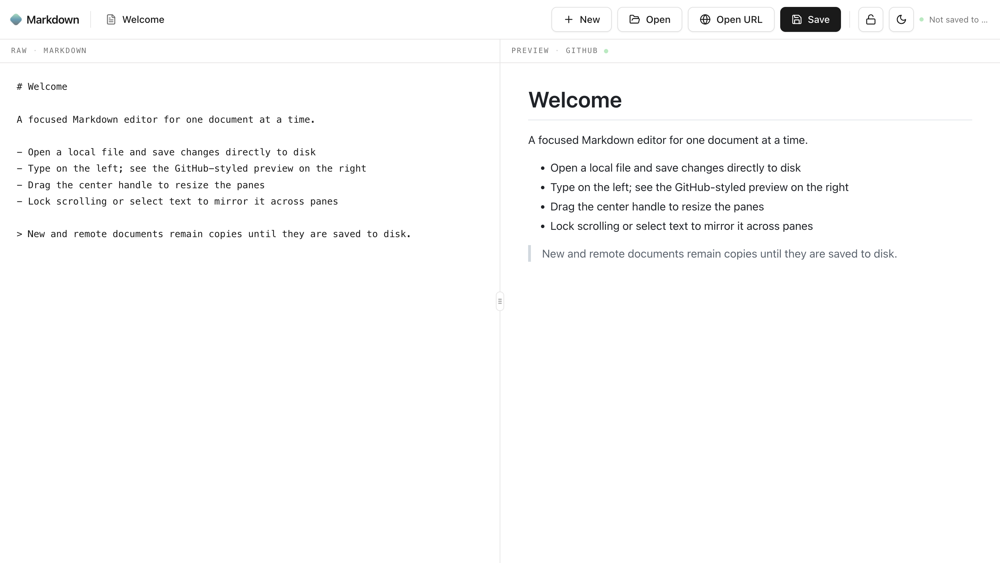
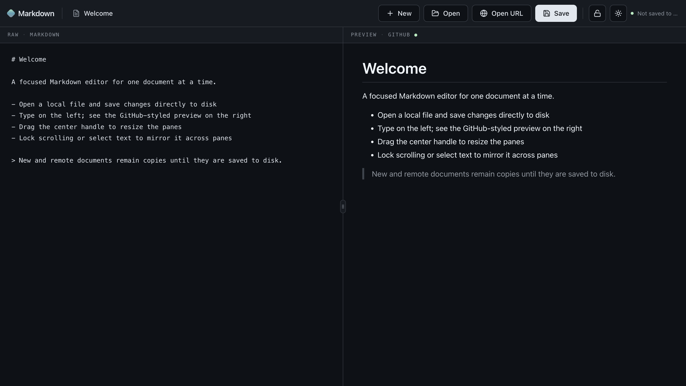

# Markdown Editor

A focused desktop Markdown editor for one document at a time. Markdown source
stays on the left and a GitHub-styled preview stays on the right, separated by
a draggable divider.

- Open local Markdown files and save directly back to disk
- Import a raw URL or GitHub file as a new local copy
- Reload clean documents changed by another app and reconcile dirty conflicts
- Restore unsaved edits after a crash or restart
- Parse and display YAML frontmatter without hiding malformed source
- Use native desktop commands for New, Open, Save, Save As, Undo, and Redo

## Screenshots

Light theme:



Dark theme:



## Download

Grab the latest desktop build from the
[**Releases**](https://github.com/Jumballaya/md-editor/releases) page:

| Platform | File |
| --- | --- |
| macOS | `.dmg` (installer) or `.zip` |
| Windows | `.exe` (installer) or `portable .exe` |
| Linux | `.AppImage` or `.deb` |

> macOS builds are unsigned. On first launch, right-click the app → **Open**, or
> allow it under System Settings → Privacy & Security.

## Develop

```bash
npm install
npm run dev   # build and launch the desktop app
npm test      # run Electron and frontmatter tests
```

## Build desktop packages locally

```bash
npm run package   # build installers for your current OS into ./release
```

## Releasing

Releases are automated. Push a version tag and GitHub Actions builds macOS,
Windows, and Linux packages and attaches them to a GitHub Release:

```bash
npm version patch      # bumps package.json + creates a git tag
git push --follow-tags
```

The `.github/workflows/release.yml` workflow runs on any `v*` tag (and via
manual dispatch for a dry run without publishing).
